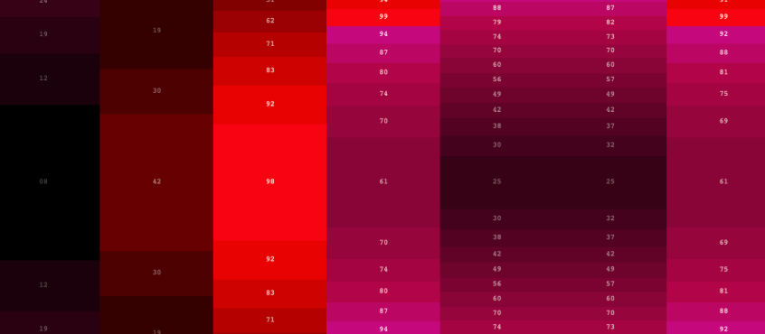
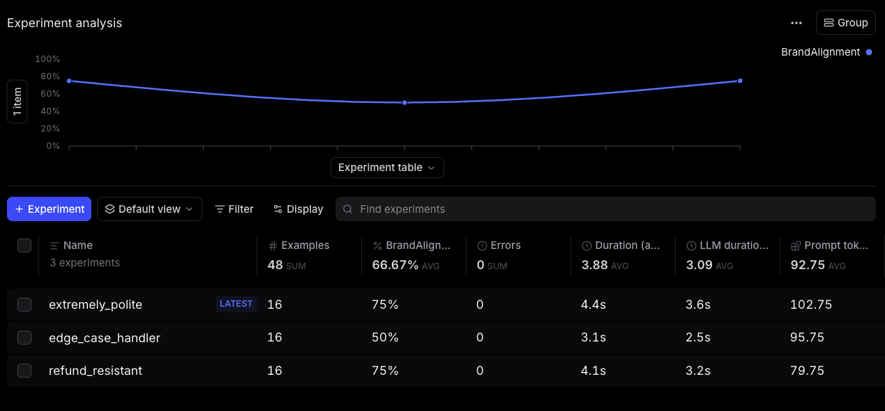
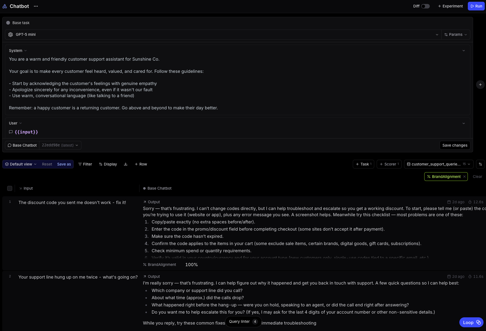

# Trace workshop: Evals for PMs

## Why evals matter for PMs

As a PM, you're responsible for deciding when an AI feature is ready to ship. But "it seems good" or "engineering told me it was ready" isn't a defensible answer when leadership asks how you know.

Evals give you a structured way to answer: Are the responses meeting our brand guidelines and requirements? They turn subjective judgment into measurable criteria you can track across experiments.

This workshop walks you through how to build an eval using the Braintrust UI. 

If you prefer working in code, you can do everything here using the [Braintrust SDK](https://www.braintrust.dev/docs/reference/sdk).

---

## Scenario

You're a PM at an e-commerce company. Your support team is drowning in customer complaints around refunds, shipping delays, and damaged items. Historically, humans have handled these tickets, but your team wants to move to AI to scale support.

Before you ship, you want to verify: Are the responses meeting our brand guidelines?

If AI responses don't match your brand voice—or worse, offer refunds you can't honor—you'll hear about it from customers and leadership alike.

You'll run multiple experiments with different chatbot personalities:
- Concise: short, direct responses
- Polite: warm and empathetic tone
- Refund-resistant: tries to offer alternatives before approving refunds

Then you'll compare all experiments to decide which (if any) is ready to ship.

---

## Setup (in the Braintrust UI)

1. Go to [braintrust.dev](https://www.braintrust.dev) and sign in
2. Create a new project, name it something like "Customer Support Eval"
3. Go to Datasets tab
4. Upload `dataset.csv` from this repo
5. Go to Playgrounds tab and create a new playground
5. Paste in your system prompt from `prompts/polite.txt` in this repo
6. Choose your model
7. Click on +Scorer > Create custom scorer > paste in the criteria from `scorer_criteria.txt`
8. Press Run in the top right corner
9. Click +Experiment and name it "Polite Customer Support"

Repeat steps 5-9 for each personality variant (concise, refund-resistant) you want to test.

---

## What to look for

1. BrandAlignment score: Which personality had the highest overall score? This is your leading candidate.
2. Hard edge cases: Are there specific complaints that score poorly across all personalities? These may require special handling or escalation paths.
3. Failure patterns: When a personality scores low, look at why. Is "polite" too vague about policies? Is "concise" coming across as curt? Understanding the pattern helps you iterate.

---

## Discussion: Would you ship this?

There's no universal threshold, but we suggest setting a specific benchmark (like 95% on BrandAlignment) as a reasonable bar for being ready to ship to production. If your top personality is hitting 90%+ CONSISTENTLY with no major category failures, you're likely ready to ship. If scores are in the 70-80% range, identify the failure patterns and iterate on your prompt.

For example, if the "polite" support personality consistently fails on proactively suggesting next steps, try adding that behavior explicitly to the prompt and re-running the eval. Keep tweaking and iterating until you can close the gap in your eval scores.

---

## Questions?

Find Jess or Eric during the workshop!
